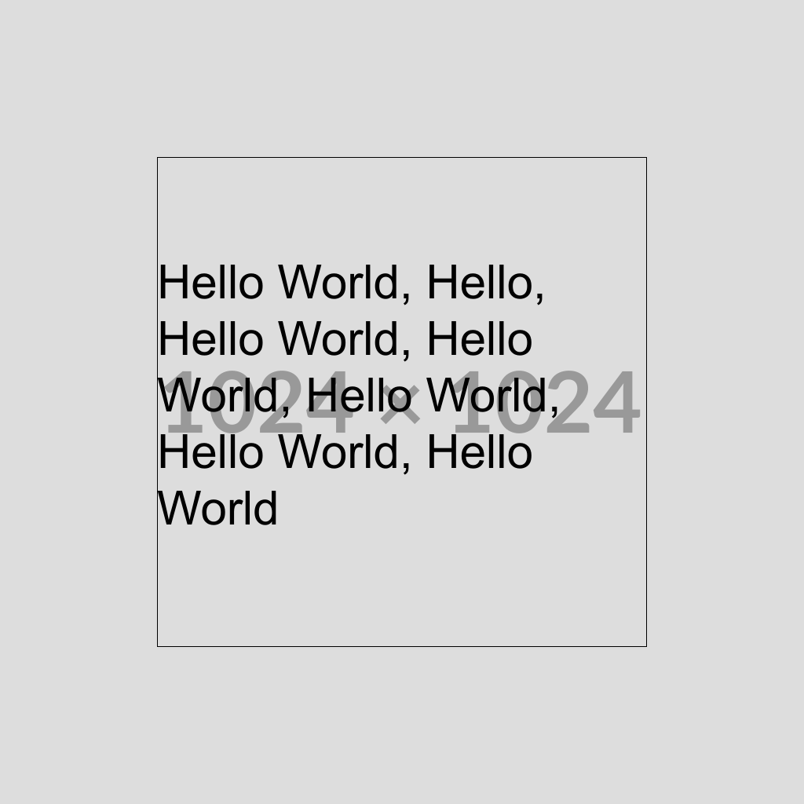

# image-manipulate
A docker container for creating images defined by a json object

## Motivation
I tried to center a text in n8n without paying someone for an api.

## Usage
In order to create an image using this container you simply need to post to `/api/v1/image` with a body like this:
```jsonc
{
    "format": "png",
    "quality": 100,
    "canvas": {
        // Target image size
        "width": 1024,
        "height": 1024
    },
    "steps": [
        {
            // First step: draw an image over the full size
            "action": "draw_image",
            "x": 0,
            "y": 0,
            "width": 1024,
            "height": 1024,
            "source": "https://placehold.co/1024x1024.png"
        },
        {
            // Second step: write a text with 200px padding to each border
            "action": "write_text",
            "x": 200, // Padding left
            "y": 200, // Padding top
            "width": 624,  // = 1024 - 2x 200
            "height": 624, // = 1204 - 2x 200
            "text": "Hello World, Hello, Hello World, Hello World, Hello World, Hello World, Hello World",
            "font_size": 60,
            "align": "left",
            "valign": "center",
        }
    ]
}
```
The resulting image will look like this:<br>


You can, by the way, leave the comments in the post body. They will be trimmed automatically.
### Installation
The image is available via docker:
```sh
docker run -p 3000:3000 tinokuptz/image-manipulate:latest
````
Browse to http://localhost:3000 and you can play around with it.

### Possible steps
Steps will be executed from to to bottom, so that you always draw "on top of the image"

### draw_image
This draws an image. Parameters:
| Name | Description | Example value |
|---|---|--:|
| `x` | x-offset (left side) of the image | `0` |
| `y` | y-offset (top) of the image | `0` |
| `width` | Target width of the image | `1024` |
| `height` | Target height of the image | `1024` |
| `source` | Source to pull the image from; must be `http` or `https` (with trusted cert) | `https://placehold.co/1024x1024.png` |
Your image will always be placed to cover your box. If you put an image with 512x512px in a width=256 and height=512 box, the left and right side of the image will be cut.

### write_text
Writes an text on the image
| Name | Description | Example value |
|---|---|--:|
| `x` | x-offset (left side) of the textbox | `0` |
| `y` | y-offset (top) of the textbox | `0` |
| `width` | Target width of the textbox | `1024` |
| `height` | Target height of the textbox | `1024` |
| `text` | The text to write | `Hello world` |

There are some optional values, too
| Name | Description | Default value |
|---|---|--:|
| `align` | Horizontal align of text in the box<br>`left` / `center` / `right` | `start` |
| `valign` | Vertical align of text in the box<br>`top` / `center` / `bottom` | `top` |
| `draw_border` | For e.g. debugging; draw a border around the textbox<br>Can be set to `true`, or even an object `"draw_border": { "color": "#RRGGBB", "stroke_width": 2, "radius": 0 }` | `false` |
| `font` | Font use | `Arial` |
| `font_size` | Target font size, in pixels | `20` |
| `color` | Color hex code | `#000000` |
| `line_break` | Break text when it's longer then the textbox | `true` |

## Quick check for image generation
This container has a gui where you can enter your json and check the output.

Simple browse to the root directory of the url

### more?
More steps might come from time to time, as soon as I need them.

In case you need some - feel free to issue a pull request.

## Development and building
For me, until I configure drone ci on this one
```sh
# AMD64
docker build --platform linux/amd64 -t tinokuptz/image-manipulate:latest -t tinokuptz/image-manipulate:1.0 .
docker push tinokuptz/image-manipulate:latest
docker push tinokuptz/image-manipulate:1.0
```